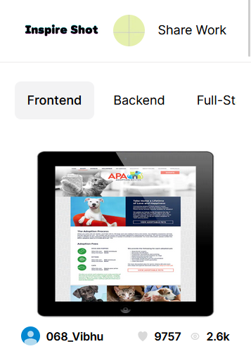
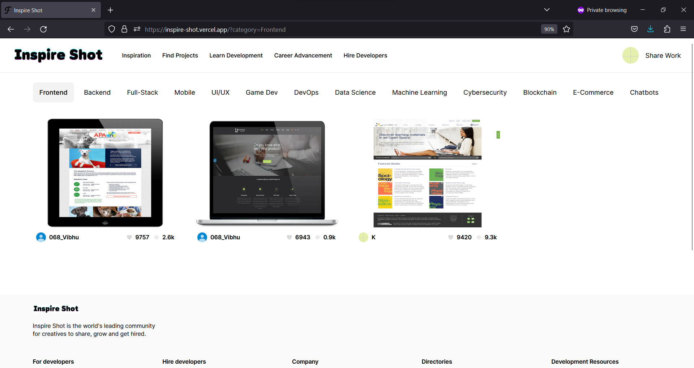
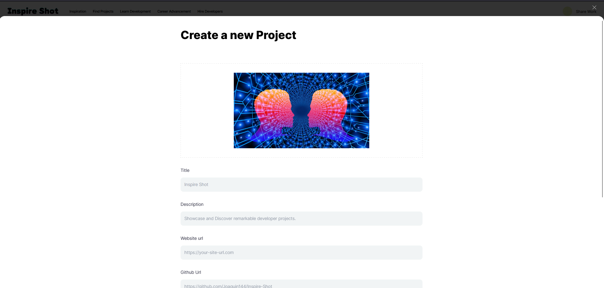
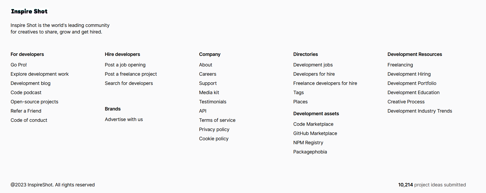

# Inspire Shot

Inspire Shot is a web application that allows designers to showcase their work, explore other designers' portfolios, and connect with the design community.

## Screenshots

## Features

- User Registration and Authentication: Users can create an account and log in to access the full functionality of the app.
- Profile Creation: Users can create their design profile by just a simple Google SignIn.
- Upload and Share Shots: Users can upload their design shots, including images and descriptions, to showcase their work to the community.
- Discover and Explore: Users can explore a curated collection of shots and filter shots based on different criteria.
- Responsive Design: The app is designed to be mobile-friendly, providing an optimal experience on various devices.

## Technologies Used

- Frontend: Next.js, React.js, CSS, Tailwind-CSS
- Back-end: GraphQL APIs, Grafbase
- Database: Grafbase
- Authentication: JWT (JSON Web Tokens)
- Image Storage: Cloudinary
- Deployment: Vercel

## Getting Started

You can setup the project by following this guide [Setup Project](gettingstarted.md).

## License

The Inspire Shot app is licensed under the [MIT License](LICENSE.md).
